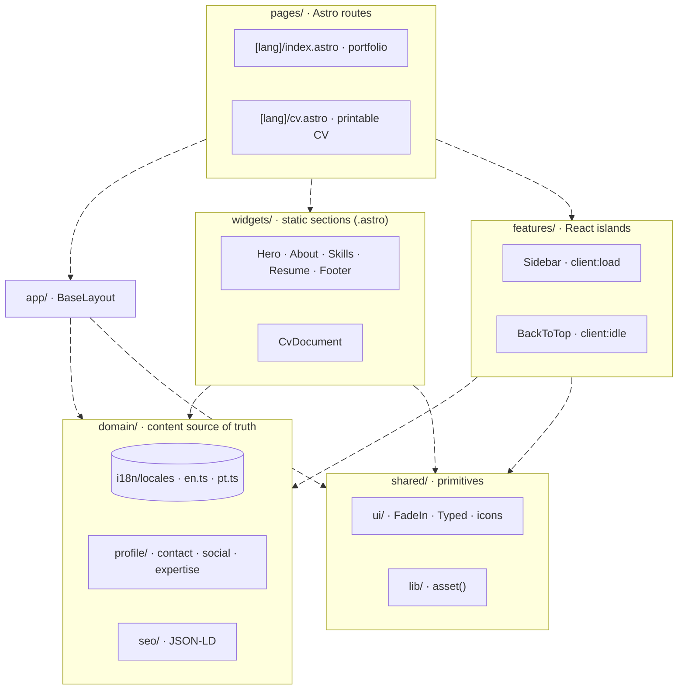

# johnson-portfolio

Personal portfolio + printable CV. Astro 7 · React 19 · Tailwind 4. Bilingual
(EN / PT-BR). Static build deployed to GitHub Pages.

Live: <https://johnsonmauro.github.io/johnson-portfolio/>

## Surfaces

| Route | Purpose |
|-------|---------|
| `/en/`, `/pt/` | Interactive portfolio (hero, about, skills, resume, sidebar) |
| `/en/cv`, `/pt/cv` | Printable / PDF-friendly CV (A4) |

Both surfaces read from the same dictionaries — content is never duplicated.

## Stack

- **Astro 7** — static output, file-based routing, native i18n (`/en/`, `/pt/`).
  Rust compiler + Vite 8 (Rolldown).
- **React 19.3** — interactive islands only (sidebar, back-to-top), via
  `@astrojs/react` 7 (Oxc JSX transform, no Babel).
- **Tailwind 4** — via `@tailwindcss/vite`; design tokens in `src/styles/`.
- **TypeScript** strict.
- **ESLint 10** flat config + `eslint-plugin-astro` 3, `react`, `react-hooks`,
  `jsx-a11y-x` (ESLint 10-compatible fork of `jsx-a11y`).
- **pnpm 12** — pinned via `packageManager` in `package.json`.

Requires Node `^22.22.3 || >=24.16.0` (floor set by `eslint-plugin-astro` 3;
Astro 7 alone needs `>=22.12`).

## Quick start

```bash
pnpm install
pnpm dev          # local dev at http://localhost:4321/johnson-portfolio/
pnpm build        # static build to dist/
pnpm preview      # serve dist/
pnpm lint         # zero-warning lint
pnpm lint:fix     # autofix
pnpm text:save    # after a build: save the rendered text of every page as a baseline
pnpm text:diff    # after a build: diff the rendered text against that baseline
pnpm cv:check     # CV copy rules: 475–600 words, bullet length, buzzwords
pnpm copy:check   # EN/PT locale parity and unused dictionary keys
pnpm favicons     # regenerate favicons from source
```

## Project layout

FSD-inspired layered architecture under `src/`. Each arrow is a real import
between layers; the flow only runs downward.



Rules the diagram encodes:

- **No upward imports.** `domain/` and `shared/` import nothing from the
  project; `pages/` only composes.
- **No widget-to-widget imports.** Something two widgets need moves to
  `shared/ui` (presentational) or `domain/*` (content, data).
- **All visible copy lives in `domain/i18n/locales`**, EN and PT-BR side by
  side; widgets and islands receive it as props.
- **React runs only in islands**: the `features/` units and the `shared/ui`
  primitives (`FadeIn`, `Typed`) that widgets hydrate with a `client:*`
  directive. The rest of `widgets/` renders to static HTML at build time.

## Content source of truth

All visible text → `src/domain/i18n/locales/{en,pt}.ts`.
All contact / identity → `src/domain/profile/profile.ts`.

If a string is hardcoded inside a component, that is a bug — lift it to the
dictionary.

## Editing the CV

CV content follows Jeff Su's resume rules. Full mentorship in
[`docs/RESUME_GUIDELINES.md`](docs/RESUME_GUIDELINES.md). Compact operating
checklist for AI / contributors in [`CLAUDE.md`](CLAUDE.md).

Workflow:

1. Pull target job description → extract 10–15 keywords.
2. Edit `en.ts` and `pt.ts` **together** (locales must not drift).
3. Rewrite each bullet through the XYZ formula
   (`Accomplished [X] as measured by [Y], by doing [Z]`); ≥ 1 metric per bullet.
4. Verify EN word count: 475 – 600 across `about.summary` + `about.current`
   + all `resume[].bullets`.
5. Strip buzzwords (*results-driven*, *team player*, *synergy*, *rockstar*, …).
6. `pnpm dev` → verify `/en/`, `/en/cv`, `/pt/`, `/pt/cv`.
7. Browser print-to-PDF from `/cv` → verify A4, no orphan headings.
8. `pnpm lint && pnpm build`.

## Deployment

GitHub Actions: [`.github/workflows/deploy.yml`](.github/workflows/deploy.yml).
Pushes to `main` build with Node 24 + pnpm (version read from
`packageManager`), then publish `dist/` to GitHub Pages. `astro.config.mjs` sets `base: '/johnson-portfolio'` — keep relative
asset URLs.

## Astro 7 gotchas

- **Whitespace is JSX-style** (`compressHTML: 'jsx'` default). Line breaks
  between inline elements no longer render as a space:
  `<span>a</span>\n<em>b</em>` → "ab". Put inline siblings inside a flex/gap
  container (current pattern) or add an explicit `{' '}`.
- **Rust compiler is strict** — unclosed non-void tags are build errors and
  invalid nesting (`<div>` inside `<p>`) is no longer auto-fixed.
- **`src/fetch.ts` is reserved** for Advanced Routing. Don't create it unless
  you mean to take over the request pipeline.
- **Markdown** uses the Sätteri (Rust) processor; remark/rehype plugins need
  `markdown: { processor: unified() }`. (No Markdown in this repo today.)

## Conventions

- **Commits** — Conventional Commits (`feat:`, `fix:`, `refactor:`, `docs:`,
  `chore:`, `ci:`, `perf:`).
- **Animation** — compositor-friendly only (`transform`, `opacity`,
  `clip-path`). Never animate layout properties.
- **Styling** — use tokens in `src/styles/`; no hardcoded palette or spacing.
- **A11y** — semantic HTML first; lint enforces `jsx-a11y-x` rules in `.tsx`
  and `astro/jsx-a11y/*` in `.astro`.

## Docs

- [`CLAUDE.md`](CLAUDE.md) — AI-agent operating rules (project map + Jeff Su
  compact checklist).
- [`docs/RESUME_GUIDELINES.md`](docs/RESUME_GUIDELINES.md) — full CV writing
  guide.

## License

Personal portfolio — content (CV text, photos) is © Johnson Mauro. Code is
available under MIT terms unless a `LICENSE` file says otherwise.
