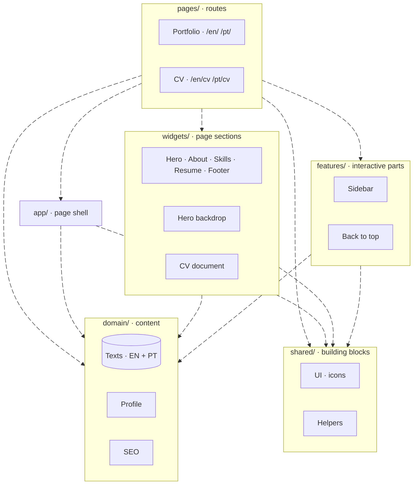

# Johnson Mauro — Portfolio & CV

[](https://github.com/JohnsonMauro/johnson-portfolio/actions/workflows/deploy.yml)

Personal portfolio of Johnson Mauro, software engineer, with a printable CV
built from the same content. English and Brazilian Portuguese.

**Live:** [Portfolio (EN)](https://johnsonmauro.github.io/johnson-portfolio/en/) ·
[Portfólio (PT-BR)](https://johnsonmauro.github.io/johnson-portfolio/pt/) ·
[CV (EN)](https://johnsonmauro.github.io/johnson-portfolio/en/cv/) ·
[CV (PT-BR)](https://johnsonmauro.github.io/johnson-portfolio/pt/cv/)


## Highlights

- **One source, two surfaces.** The interactive portfolio and the A4 CV read
  the same content, so they never drift apart. The CV prints or saves as PDF
  straight from the browser.
- **Bilingual.** Every page in English and Brazilian Portuguese, switchable
  from the sidebar.
- **Animated first screen, written from scratch.** A WebGL tide in the brand
  blues under a network of connected people: they drift in depth, link to
  whoever is near, pass signals along the links and follow the cursor. The
  copy sinks away as you scroll. No animation library, about 5 KB gzipped.
- **Considerate motion.** With reduced motion enabled everything holds still;
  the animation pauses when the hero is off screen or the tab is hidden, and
  without WebGL the network still shows over a CSS gradient.
- **Light and dark themes**, remembered per visitor.
- **Accessible and static.** Semantic HTML with strict accessibility linting;
  the pages are plain HTML, with JavaScript only for the interactive parts
  and the hero animation.

## Built with

[Astro](https://astro.build) (static output, i18n routing) ·
[React](https://react.dev) islands for the interactive parts ·
[Tailwind CSS](https://tailwindcss.com) · TypeScript · WebGL and Canvas 2D ·
ESLint · pnpm · GitHub Pages.

## Run it locally

Requires the current Node.js LTS (`nvm use` reads `.nvmrc`) and pnpm, at the
version pinned in `packageManager` in `package.json`.

```bash
pnpm install     # also installs the pre-commit hook
pnpm dev         # http://localhost:4321/johnson-portfolio/
```

| Command | What it does |
|---|---|
| `pnpm build` / `pnpm preview` | Build the static site into `dist/` and serve it |
| `pnpm lint` | Lint code and stylesheets (zero warnings) |
| `pnpm check` | Type check |
| `pnpm copy:check` | English and Portuguese content in step, no unused text |
| `pnpm cv:check` | CV length, bullet and wording rules |

## Where things live



All visible text lives in `src/domain/i18n/locales/` (`en.ts`, `pt.ts`);
contact details in `src/domain/profile/profile.ts`.

## Deployment

Every push to `main` builds the site and publishes it to GitHub Pages
([workflow](.github/workflows/deploy.yml)). Pull requests run lint, type
check, content checks and the build first ([CI](.github/workflows/ci.yml)).

## Contributing

The engineering rules (architecture, content, design, tooling) are written for
people and coding agents alike in [`CLAUDE.md`](CLAUDE.md) and the guides
under [`.claude/skills/`](.claude/skills/). The CV writing guide is
[`docs/RESUME_GUIDELINES.md`](docs/RESUME_GUIDELINES.md).

## License

Personal portfolio — content (CV text, photos) is © Johnson Mauro. Code is
available under MIT terms unless a `LICENSE` file says otherwise.
